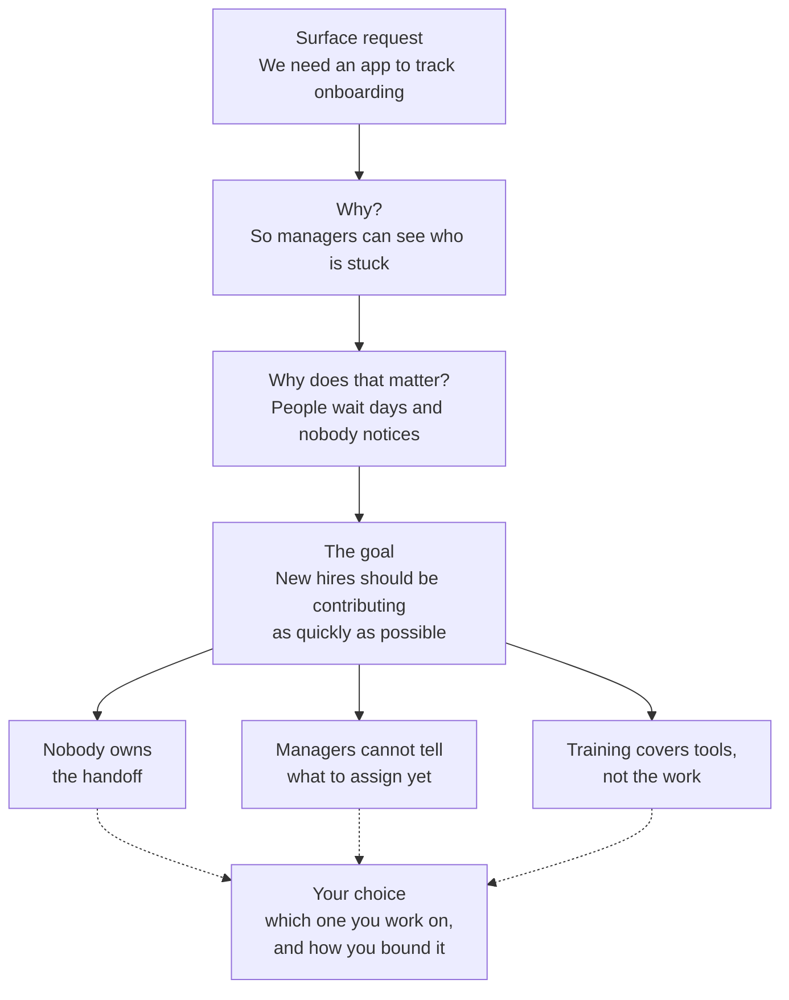

## Sprint 1, Half One: working draft (v4)

The whole move, from arriving with nothing to committing to one problem. Written as page prose. The `##` headings are the artifact boundaries: three own-your-progress activities, a concept check, and one graded item. Everything under a `##` heading is one Canvas item.

Design notes appear inline as [NOTE] blocks and are not part of the page text. Open questions are marked [OPEN]. The Part and activity labels stay; the A-F letters are gone.

> **[NOTE] Version 4, 10 September.** Restructured from v3 on Leslie's review of A through D. Week 1 now runs on the own-your-progress rhythm: three ungraded activities that build one table, a concept check, and one graded item. Each activity teaches a move and then has the learner run it on their own list, so no row leaves an activity with an empty middle column. The old section D is gone: D1 deleted (Leslie), D2 through D5 folded into the graded item as its opening parts, and a new step, choosing which rows go forward, sits in front of them. B5 moved into the third activity. E and F are carried over as drafted in v3 and are unreviewed; the only changes there are the removed "Submission 2 of 2" line, cross-references that named old section letters, and the resolved Introduction note under Check 4.

> **[NOTE] Rhythm.** Own-your-progress items are Canvas assignments at zero points with a must-submit completion mark, in an ungraded grade group, per Sathya's Fall 2026 mechanic. Encouraged, not required: skipping one never blocks the next. Whether other sprints adopt this is a course-level call, logged and deferred.

## OYP 1. Start your list and get underneath it

> **[NOTE]** Own-your-progress activity 1. Zero points, must-submit. The learner leaves with a table, one row per item, every row carrying a current state or a mark where the move gave nothing back.

### Take five minutes

We are going to move into the problem identification process.

Let's start somewhere relatively simple. Take five minutes. Write down three or four things that bug you.

Things that irritate you, that you complain about, that you keep meaning to deal with, or that take longer than they should. A decision you keep postponing. Something you have been putting off for months. A condition you have decided you cannot change. Work, a job search, a volunteer role, caregiving, a side project. Anything.

Rough is the point. A phrase each is fine. Do not filter, and do not decide yet whether any of them is worth anything.

> Nobody tells me when a client account changes hands. New volunteers sign up, come twice, and we never see them again. Every month I rebuild the same report by hand. I should be better at using AI at work.

One thing to consider before you start. Try to include at least one item that other people are involved in, not only things you do alone. It does not have to be at work, but it should touch somebody besides you.

If nothing comes to mind, read on anyway. This page will give you other places to look.

### What we did not ask for

We started with things that bug you, because problems rarely arrive as well-defined problems. Almost nothing shows up already matching the definition this course uses for a problem: a gap between how something works now and how it could work, where the gap costs someone something real. What shows up instead is the feeling that something is off.

That feeling is an indicator, something that points at a problem without being one. Your list is a list of indicators, and at this stage that is exactly what it should be.

### Moving from indicator to problem

Now you have a starting list of indicators. We are going to do some pushing on this list to see if any of them can be moved toward problems.

Remember, a problem is a gap between how something works now and how it could work. So getting underneath something that bugs you means describing how it actually works now, in enough detail that you can see why it produces the thing that bugs you.

That is the next move. Not describing why it bothers you. Not saying what would fix it. Describe how it currently works.

| **What bugs you** | **How it actually works now** | **The gap starting to show** |
|---|---|---|
| Nobody tells me when a client account changes hands | Handovers happen in a conversation between two people. Nothing is written down and nobody owns telling anyone else | People act on stale ownership for days, and the client repeats themselves to someone who should already know |
| New volunteers sign up, come twice, and stop | Signups are collected centrally. When a new volunteer comes they do whatever the person running that day improvises | A new volunteer's first month depends entirely on who happened to be there, so most of them never find something that needs them |
| Every month I rebuild the same report by hand | The source system exports tables in a format that doesn't quite match the way we use them. Everyone who needs the report fixes it themselves | Every reporting team spends the same twenty minutes solving the same problem, and nobody has ever counted how much time it's costing us |

Notice what the middle column does. It does not diagnose and it does not solve. It describes the current state carefully enough that the gap starts to become visible on its own.

### One pass is usually not enough

What you get first is often still too vague, or too small, or turns out to be a symptom of something else. Run the move again on what you just wrote: how does that work now?

Here is the volunteer example going down three passes:

> **Pass 1.** New volunteers sign up, come twice, and stop. **How does that work now?** Signups go to a central inbox. What happens on a first shift is whatever the person running that day improvises.

> **Pass 2.** First shifts are improvised. **How does that work now?** Nobody owns deciding what a new volunteer should do on day one, so the shift lead invents something on the spot, usually the easiest thing to hand off.

> **Pass 3.** Nobody owns a new volunteer's first day. **How does that work now?** We measure signups because signups are what the board asks about. Nobody has ever been responsible for what happens after someone arrives, so no one built it.

Notice that pass 1 could not tell you who was paying or what it cost them. Pass 3 can.

Three or four passes is normal. You stop when you reach something specific enough that you could say who it is costing and what it costs them.

### Your turn: build your table

Now do this for your own list.

Make a table with the same three columns: what bugs you, how it actually works now, the gap starting to show. One row per item. This table is where everything in the first half of the sprint collects, so keep it somewhere you can come back to. You will add to it twice more and then carry it into the graded work.

Then run the move on every row. For each item, write two or three sentences in the middle column on how it actually works today. Not how it feels. What happens, in what order, and who does what.

Three guardrails for the middle column:

  - **Describe, do not diagnose.** If you find yourself writing "because nobody cares," stop and write what actually happens instead.

  - **No fixes yet.** If a sentence starts with "we should," it does not belong in this column.

  - **Name who does what.** "The report gets fixed" hides a person. "I fix the report" does not.

For the third column, one sentence is enough: what gap is starting to show, who it seems to touch, and what it seems to cost them. Rough is fine. A question mark at the end of a sentence you are not sure of is worth more than a confident guess.

**Take one item further.** Pick the row you have the most to say about and run the move again on what you just wrote, the way the volunteer example does: how does that work now? Two or three passes. Stop when you could say who it is costing and what it costs them.

**If the move stalls.** Sometimes "how does it work now" comes back thin. Usually that means what you wrote is too broad or too vague to describe yet. These can restart it:

  - What would this look like if you had never adapted to it?

  - What specifically happened the last time this went wrong?

  - Which part of this could actually move, and which part is fixed?

  - What is it about this that you cannot tell?

Use whichever gets your thinking going. They are prompts, not a procedure. If you continue to struggle with one indicator, try another one.

**If the move does nothing at all.** Not thin, nothing. Leave the middle column empty and put a mark next to the row. Do not push harder. Items like that usually turn out to be something other than an indicator, and the third activity in this sequence is built for them.

> **[OPEN]** The no-AI instruction below is the narrow version from v3's section D, moved here because this is where the raw material gets gathered. Leslie's review comment questioned whether it is needed at all. Kept pending her ruling.

> **It's best to do this activity without AI.**

> This is not a rule about AI being unhelpful. You will use it frequently in this course. The reason is narrower: the raw material here has to come from your own life, and AI does not have access to what you have stopped noticing, what you keep putting off, or what your team works around. It can produce a plausible list of problems for someone in your role, and every item will be generic, because generic is all it can see from where it sits.

### If your list is thin

Things that bug you are a good first place to look, because you can feel them. There are at least two other places to look, and you cannot feel either one of those.

**Things you stopped noticing.** You stopped noticing them because you figured out a work-around, so they stopped registering as friction. These do not bug you any more, but they are places where a problem, a gap that costs someone something real, might exist. They have to be hunted rather than recalled.

**Things somebody handed you.** A request, from a manager, a client, or even from yourself. These arrive already looking like the answer, but there is a reasonable chance that they are a solution someone decided on before they carefully considered the actual problem.

The next two activities take each in turn. Do them whether or not your list is thin, because the second source comes up constantly at work and it is the hardest of the three to spot.

### What to submit

Your table, with every row carrying something in the middle column or a mark where the move gave nothing back. Rough is the point. Nobody grades this. Submitting it marks the activity complete and leaves you a copy to build on in the next two.

## OYP 2. Things you stopped noticing

> **[NOTE]** Own-your-progress activity 2. Zero points, must-submit. Elapsed time is part of the design: the learner watches for a day or two, then adds rows.

### Where habits hide problems

Say you pull a report every month. The system exports it in the wrong format, so you paste it into a spreadsheet and fix the columns by hand. Twenty minutes, every month, for two years. You probably don't even think about that as a problem anymore. You just think of it as "how I do the report."

That is how work-arounds go. They accumulate gradually enough that they just become the normal way you do things, and if someone asked whether anything was wrong, you would say no. The problem stops being stored in your memory as a problem. It gets stored as a habit.

This is not a flaw. Getting through hard things without stopping to examine every friction is a skill, and it is how many of us function. It is also why some things worth fixing start to become invisible.

### Your turn: watch for a day or two

For the next day or two, notice the moments where you route around something. The step you always redo. The person you always have to chase. The file you keep a private copy of because the shared one is wrong. Add them to your table as they happen.

[TODO: short video here, 2 to 3 minutes, captioned. Someone describing a work-around of their own that they had stopped seeing as a problem, and the moment they noticed it. Video cannot be embedded from Markdown; add on the Canvas page after publish.]

Then run the same move on each new row: how does it actually work now, and what gap is starting to show. Work-arounds are often easier to get under than complaints, because you already know the mechanics. You have been performing them by hand.

Two new rows is a good haul. None is also a result. If a couple of days of watching turn up nothing, say so when you submit and move on. Your list from the first activity is still there.

### What to submit

Your table with the new rows added and the move run on each, or a line saying you watched and found nothing.

## OYP 3. Things somebody handed you

> **[NOTE]** Own-your-progress activity 3. Zero points, must-submit. This one carries an extra move, up before down, and picks up the items the first activity could not get under. Melisa's earlier note stands: the requests branch is longer than the other two because it needs more machinery.

### Solutions that arrive before the problem

This one is a little tricky, but if you look for it, odds are you'll find some examples in your own experience. The idea here is that sometimes, maybe especially at work, we are handed solutions that don't match the problem they are trying to solve.

> "We need an app to track where new hires are in their onboarding process."

This person has expressed that they want an app to track where new hires are in the onboarding process. Maybe they have sufficiently analyzed what's happening to know this is the right solution. However, very often, they haven't. Instead, maybe they decided to build an app because they like new apps, or because their colleague at another organization just built one, or maybe they do know that the onboarding process isn't smooth and they assume an app will make it better. In this situation, someone is naming what should be built rather than what should be different. They are assuming an answer before anyone has determined what the question is.

We'll call this type of indicator a surface request. We handle surface requests a little differently than the other indicators. The other two sources start vague and get specific. A surface request is already specific, and settled on the wrong thing. So instead, you go up first, to the goal the request is serving, and only then back down to the problem.

#### The way up is to keep asking why

Ask until you reach something nobody would argue with.

> *We need an app to track where new hires are.* **Why?** So managers can see who is stuck. **Why does that matter?** Because people sit for days waiting on something and nobody notices. **Why does that matter?** Because new hires should be contributing to their teams as quickly as possible, and right now they are not.

That last answer is the goal. Two things tell you that you have arrived:

  - Nobody in the organization would dispute it.

  - It says nothing about what to build.

If your answer still contains a solution, you have not gone far enough. "So we have better visibility" is not a goal. It is the original request wearing a different coat.

#### The goal opens up the problem

Now that you have the actual goal stated plainly, let's take another look at the request. Tracking visibility of where new hires are in the onboarding process is only one of several things that could be going wrong:

  - Maybe nobody owns the handoffs from HR to IT to their department, so setup steps fall through and the first week is lost.

  - Maybe managers cannot tell what a new hire should be capable of at week two, so they under-assign and wait.

  - Maybe training covers the tools but not the actual work, so people finish it and still cannot start.

All three are plausible. All three are real in some organizations. Each one would send you down a different path, and only the first is a visibility problem that an app might touch.

> **[NOTE]** This is the one edit of yours I did not take, flagged earlier. You had "each one requires a different solution." The paragraph is separating problems from solutions, so ending it by sorting problems by their solutions works against it. Overrule me if you disagree.

The chain did not hand you a problem. It handed you a goal and three candidates for what is in the way. Which one you work on, and how you bound it, is your call. Nothing in the goal or the request decides it for you, and making that choice deliberately rather than by default is a large part of what this sprint is for.

#### When the move gave nothing back

Sometimes you run the move and get nothing back. Not thin, nothing.

Look at the fourth example from the first activity's list: "I should be better at using AI at work." If an item on your own table gave the move nothing back, it probably belongs here too.

Ask how that works now and there is no answer, because "use AI" is not something that is happening. It is something you have decided to do. That is the tell: **you have written down a solution, not an indicator.** The move you have been using only works on things that are already going on.

The way out is not to push harder. It is to ask what made you want that solution in the first place. Someone who wrote that line might find, underneath it, that information arrives in email, Slack, and meeting notes and gets re-entered by hand into calendars, to-do lists, and reports, because nothing connects those systems. That is a current state, and this move works on it normally.

Solutions you have handed yourself are common enough to deserve their own treatment, which is the next section.

#### The requests you hand yourself

It's important to note that requests do not only come from other people. It is well worth looking at the requests we give ourselves.

> "I need to fix my resume."

Nobody assigned that. It still hands you a solution before anyone has named the problem, and the same chain applies:

> *I need to fix my resume.* **Why?** Because I am not getting interviews. **Why does that matter?** Because I have been applying for five months and I am running out of runway. **Why does that matter?** Because I need to be in a role that uses what I am good at and pays what the work is worth.

That is the goal. And once it is stated, the resume is only one of the things that might be in the way:

  - The roles you are applying to do not want what you are strongest at, so the resume is fine and the targeting is wrong.

  - Your resume lists responsibilities rather than evidence of solving the problems these roles have.

  - You are applying cold to postings where these roles get filled through referrals.

Only the second is a resume problem. The first is a targeting problem and the third is a channel problem. Fixing the resume would consume weeks and change nothing in two of the three cases.

A self-issued request is harder to notice than one from a manager. When your boss hands you a solution, it is at least visibly someone else's answer. When you hand it to yourself, it feels like something you already figured out. "I should be better at using AI at work" is one of these. So is "I need to get organized," and "we should have a better process for this."

Check your list. Anything phrased as "I need to" or "we should" is usually a request wearing a problem's clothes.

### The test

Whatever is in front of you, ask this:

**Does it name what should be different, or does it name what should be built?**

If it names what should be built, you have a request, and there is a problem underneath it you have not seen yet. If it names something that should be different but you cannot yet say who it costs and what it costs them, you have an indicator and you are not finished going down.

Find the gap, and you have a candidate problem.

### Your turn: go up, then down

Look at your table for two kinds of row: anything somebody asked you for, and anything you wrote in the shape of "I need to" or "we should." Include any row you marked in the first activity because the move gave nothing back.

Take each one up the chain. Why? Why does that matter? Keep going until you reach a goal nobody would dispute and that says nothing about what to build. Write the goal down.

Then fan out. List two or three things that could be standing between the current situation and that goal. You do not have to be sure. You are naming possibilities, and only the ones you can actually see from where you sit go any further.

Put those into the table as their own rows and run the move on each of them like any other indicator: how does it actually work now, and what gap is starting to show. The request itself does not get a row. The problems underneath it do.

If the chain brings you back to the original request as the only thing in the way, that is a result too. It means someone did the analysis, and you can keep the row as it was.

### Where you are now

Your table now holds candidate problems from up to three sources: things that bugged you, things you had stopped noticing, and things that arrived as requests. Some rows are one pass deep and some are three. That is fine.

Count what you have. Three is the floor for the graded work that follows, and five is plenty. If your first list already gave you four rows with a gap showing, the second and third activities were reading, and that is what "encouraged, not required" means. What they are for is making sure the list you carry forward was gathered from more than one place, because the source you skip is usually the one hiding the problem that would have survived.

### What to submit

Your table, with any rows added from requests and the move run on each.

## Concept check

> **[NOTE]** Self-check, 5 points, `type: quiz`, placed here by default: the teaching ends with the third activity, and the checks are practiced inside the graded item rather than taught before it. The six questions from v3 must be re-verified against the v4 pages before the quiz is rebuilt, on both counts: every prompt answerable from page text, and answer integrity. Not drafted in this document.

## Graded item. Test and commit

> **[NOTE]** The week's one graded item. Suggested 35 points, absorbing the 15 that v3 put on a separate Candidate List submission. Five parts, one submission. Parts 3 through 5 are v3's sections E and F, unreviewed.

You have a table with more rows than you need and a few days between you and the day you wrote most of them. This is where the first half of the sprint turns: from gathering and holding loosely to choosing one problem and standing behind the choice. Five parts, one document at the end.

### Part 1. Choose which rows go forward

Start by rereading your table with fresh eyes. The checks work better on a list you did not write ten minutes ago, which is why this part sits on the other side of a submission from the gathering.

Keep every row where the move worked: the middle column describes a current state, and the third column shows a gap. Set aside, without deleting, any row where it did not.

If that leaves more than five, take the five where the gap is clearest. Not the most important, and not the most interesting. The checks in Part 3 decide that, and this step should not get ahead of them.

If you have fewer than three, go looking. Go back through the second and third activities first, and then watch for these over a couple of days:

  - You brace before a recurring meeting, task, or conversation.

  - You explain the same thing over and over to different people.

  - Something small irritates you more than it warrants.

That last one is the most reliable. When your reaction does not match the visible cause, the extra intensity is usually coming from something that has not been named yet.

One more thing to watch for. If everything on your list is something only you touch, go find at least one that involves other people. In Sprint 3 you will need someone who is not you to talk about your problem, and a problem nobody else has any stake in cannot supply that.

Everything you set aside stays in the table. You may want it in Part 5.

### Part 2. Write each one as a gap

Each row you kept already has a current state and a gap starting to show. Now write it in this shape, which adds the three things the checks will need:

> **Right now,** how it works today. **It could,** the state you think is possible. **The gap costs,** who is paying, and what it costs them. **This has been going on,** roughly how long. **It has not been fixed because,** your best current guess.

Worked example:

> **Right now,** account handovers happen in a conversation between the outgoing and incoming owner, and nothing is recorded or announced. **It could** be that the rest of the team knows within a day of a change. **The gap costs** clients, who repeat context to someone who should already have it, and the four other people on the team who act on stale ownership for days at a time. **This has been going on** as long as I have been here, at least two years. **It has not been fixed because** each individual handover feels small enough to handle informally.

Rough is fine. Nobody is grading the prose.

Once an item is written in this shape, it has earned a name. These are your candidate problems, the term from the Introduction: problems you are considering but have not committed to. Everything from here to the end of the sprint works on this list.

Three is the floor for a reason: if you only find one, the risk is that you commit to the first thing that came to mind because it was the only thing that came to mind.

**Mark what you are not sure about.** Read back through what you wrote and put a question mark at the end of any sentence you are not certain of. The "costs" and "has not been fixed because" lines are usually the guesses.

Do not go back and make those sentences sound more confident. Marked uncertainty is worth more here than confidence you have not earned, and in Sprint 3 you will be marking every claim as confirmed or inferred. This is that habit, early and cheap. These marks also have a nearer future: in the second half of this sprint you will name your assumptions in your frame, and your question marks are where most of them will come from.

### Part 3. Run the four checks

#### What the checks are for

You have three to five candidate problems. Before you commit nine weeks to one of them, you are going to run each through four checks, and most of your list will not survive. That is the intended outcome, not a sign you gathered badly.

Here is what the checks actually are. Each one is borrowed from a demand this course will make on your problem later. Check 1 asks whether there are specific people, because in Sprint 3 you will talk to one of them. Check 2 asks how it is handled today, because your frame has to describe that next week. Check 3 asks whether it is live, because everything you do from here works on the current state of a problem, and a problem that is not running has no current state. Check 4 asks whether it is the right size, because the next nine weeks need somewhere to go.

So the checks are not a quiz about your problem. They are the course, arriving early. A candidate that fails a check was going to fail anyway; the check just moves the failure to now, when it costs you twenty minutes, instead of week five, when it costs you half the course. This is the cheapest place in the next ten weeks to find out.

Two things about how to run them. First, the bar is honest looking, not verification. You are not proving anything. You are answering each question as truthfully as you can from what you already know, and noticing where you cannot answer at all. Second, where you cannot answer, write that down instead of guessing. "I do not know who else this costs" is a result, and a more useful one than an invented answer, because it tells you what you would need to find out.

One warning before you start. If a check never rules anything out, it is not doing anything. If your whole list passes all four checks cleanly, do not congratulate yourself yet. Look again, because you are probably answering from assumption rather than knowledge.

#### Check 1. Are the people real and specific?

Your gap statement already names who is paying. This check asks whether that answer is specific enough to act on.

Here is why it matters. A cost is only real if it lands on someone. "This wastes everyone's time" sounds like a cost, but if you cannot say whose time, you cannot say how much, whether it matters, or whether they would agree with you. And in Sprint 3 you will sit down with someone who knows this problem from the inside and ask them how it actually works. A category cannot have that conversation. A person can.

So the test is this: could you go find these people? Not in principle. Could you name them, or name their role in a place you can point to? Name people or roles, not categories. The difference:

| **Does not pass** | **Passes** |
|---|---|
| The team | The four account managers who cover renewals |
| Everyone gets frustrated | The shift lead, who improvises a job for every new arrival |
| Our clients | The two clients who have asked twice this quarter who owns their account |

To run the check, take your "who is paying" line and keep asking one question: who, specifically? Stop when you reach people you could actually get to.

Two candidate problems, one passing and one failing:

> The gap costs clients, who repeat context to someone who should already have it, and the four other account managers who act on stale ownership. I sit next to three of them.

> The gap costs the whole company, because meetings run long and everyone loses focus.

The first names two groups, counts them, and knows where they sit. The second names everyone, which is the same as naming no one. If someone asked "which meetings, whose focus," there is no answer yet.

One thing this check does not require: the person paying does not have to be someone else. "Me, and here is what it costs me" is a specific answer. A problem can be entirely yours: a job search, a skill you need, a workload only you carry. What a problem cannot be is unreachable, and that is Check 4's business, not this one's.

If you cannot get more specific than a category, that is a result, and it usually means the problem is bigger than you can see from where you sit. The fix is Check 4's move: come down to the piece of it you can see people in.

#### Check 2. Is something already handling it, and falling short?

Complete this sentence: "X handles this today, but it does not ___."

Here is why the sentence has that shape. Almost every real problem is already being handled somehow. Usually badly, and often by a person quietly absorbing it. If your problem is real and current, someone is coping with it right now, because the work has not stopped and the world has not ended. Naming how it is handled today does two things for you. It forces you to describe the current state, which your frame will need next week. And it points at the person doing the absorbing, who is your best lead for Sprint 3, because nobody knows a problem better than the person coping with it.

To run the check, name the X first. X can be a system, a process, a habit, or a person. Then fill the blank with something the handling fails to do. The blank has to be a thing it does not do, not a grade.

> The outgoing owner handles this today by telling the incoming owner directly, but it does not reach anyone else on the team.

> HR handles onboarding, but not very well.

The first names the mechanism and the exact place it stops working. The second is a review score. "Not very well" tells you nothing about what to fix and gives you nothing to check with anyone.

If you cannot name an X at all, look twice before celebrating. Finding something genuinely unhandled is rare. More often, nothing handles it because nobody has needed it handled, and that is a sign the cost is smaller than you thought. And before you settle on "nothing," look for a person. When there is no system and no process, there is usually someone doing it by hand, and that person is your X.

#### Check 3. Is it live right now?

Is this happening currently, or is it a memory or a hypothetical?

Here is why it matters. Everything you do in this course works on the current state of a problem. You will describe how it works now, ask someone how it works now, and find out things you did not know about how it works now. A problem that is not running has no current state, so there is nothing for any of that work to grab. Memories and hypotheticals slip onto lists anyway, because they generate the same feelings a live problem does. The feeling is real. The problem is not there.

The test: could you go watch this happen, or see fresh evidence of it, within the next two weeks? Not remember it happening. Not predict that it would. Watch it.

> Two accounts changed hands this month, and both clients had to repeat context that should have travelled with the account.

> At my last job, support tickets sat unassigned for days because nobody owned triage.

The first is observable this week. The second may have been completely true, but you cannot go look at it, and there is no one you can ask about how it works today, because it is not working anywhere you can reach.

A failure here comes in three shapes, and each tells you something different. A problem from a job you left is a memory; check whether the same pattern is running where you are now, because it often is, and that version is live. A problem that would appear if the team doubled is a hypothetical; ask what its early version looks like today, and if there is no early version, put it down. A problem that was fixed six months ago is a memory even if it still annoys you; the annoyance is real and the problem is gone.

#### Check 4. Is it the right size?

This check works differently from the other three, and you should know that going in. The first three can kill a candidate problem. This one never kills anything. It tells you to move.

The question: does this problem give the next nine weeks somewhere to go?

Here is why it matters. Wrong size is the failure that shows up late and quietly. A too-small problem sails through the early weeks and then stalls, because you already know everything about it and there is nothing left to find out. A too-big problem stalls immediately but vaguely, because you cannot even describe how it works now, so nothing you write feels solid. Neither failure announces itself in week one. This check is how you catch it in week one anyway.

The problem is the right size when all three of these are true:

- You can describe how it works now in one paragraph.

- There is at least one person other than you with a stake in it or knowledge about it, who would talk to you about it.

- There is at least one thing you would have to find out to move on it.

These three are not arbitrary, and it is worth seeing why. Each one is a preview of a demand the course is about to make. The paragraph is your frame, which you write next week. The person is your Sprint 3 conversation, and notice that they do not have to be affected by the problem. Someone who knows how it works from the inside counts. The thing to find out is your Sprint 4 gap. A problem that fails one of the three will stall in a specific week, and you can see which week from here.

If your problem is personal or family territory, the second test has a plainer version: can you name at least one person outside your household you could talk to about this, and would it be normal to ask them? A caregiving logistics problem passes, because coordinators, pharmacists, and other caregivers exist and are normal to ask. A problem that lives entirely between you and your own teenager does not, because interviewing your child with prepared questions is not the conversation Sprint 3 asks for.

**Too small looks like:** only you touch it, one decision or one conversation would resolve it, and there is nothing you would have to find out. One special case of too small is worth naming: you know exactly what to do and have not done it. That is not a framing problem, and neither AI nor this course will help much with it.

**Too big looks like:** you cannot describe the current state in one paragraph, nobody owns it, and everyone is affected, which usually means you can name no one.

Neither is a reason to drop a candidate problem. Both are reasons to move it. Here is each move, worked:

| **Problem** | **Diagnosis** | **The move** | **Result** |
|---|---|---|---|
| The export format for my monthly report is wrong | Too small. Only I touch it, and one ticket would fix it | Go up. What is this an instance of? | Nobody owns export definitions when the source system changes, so every reporting team patches by hand |
| Our culture resists change | Too big. Cannot describe the current state, cannot name who pays | Go down. Pick one instance you have actually seen | Decisions made in the Tuesday leadership meeting do not reach the people who execute them until the following week |

After you move a candidate up or down, run all four checks again on the moved version. Moving changes the answers. The people, the handling, and the liveness of "nobody owns export definitions" are not the people, handling, and liveness of one wrong report format.

> **[NOTE]** Resolved 9 September: the Introduction's four-check list now carries the right-size wording (PR #46).

#### Run all four on each candidate

Go through your list one at a time. A few sentences per check. Rough is fine.

Where you cannot answer a check, write that instead of guessing. "I do not know who else this costs" is a result, and a more useful one than an invented answer.

#### Reading the results

Not every failure means dropping something.

- Fails outright. Nothing to name for Check 1, or it is a memory. Set it aside.

- Murky. You could not answer, but you can imagine finding out this week. Keep it live and note what you would need.

- Wrong size. Passes in principle but is too small or too big. Move it up or down and run the checks again on the moved version.

- Passes cleanly. Rarer than you expect. If more than two do this, look again, because you may be answering from assumption rather than knowledge.

### Part 4. Take your checks to AI

Now bring AI in, and notice what you are using it for. Not to find problems, and not to run the checks. You have already done both. You are using it to find out where you answered from assumption instead of knowledge, which is difficult to see in your own writing.

Give it your two or three strongest candidate problems and your check answers, and ask something like:

> Here are candidate problems I am considering and my answers to four checks. For each one, tell me which claims I am asserting rather than actually knowing, and where someone who works in this area would likely disagree with me. Do not tell me which to pick.

Then read what comes back critically. Some of it will be generic and worth ignoring, because it cannot see your situation. Some of it will land, and the ones that land are usually the places you wrote quickly.

**Record two or three challenges it raised and your response to each.** Your response can be "fair, I do not actually know that," or "no, I have seen this directly and here is how." Both are good answers. Only agreeing with everything is a bad answer, and so is dismissing all of it.

> **[NOTE]** This is the AI exchange, placed after the checks rather than inside them. Follows Melisa's Sprint 4 V3 pattern, but folded into this submission rather than standing alone, to avoid a third deadline around one afternoon's work.

> **[OPEN]** Depends on the unresolved Dojo and API key decision. If the Dojo is not ready, this can run in any chatbot, but the instructions differ.

### Part 5. Commit

#### Pick one

This is the turn of the sprint. Everything up to here was disposable on purpose. From this point on, one problem gets the rest of your attention for nine weeks.

Pick the candidate problem that came through the checks in the best shape. Not the one you like most, and not the one that would be most impressive if you solved it.

#### Say why it, and why not the others

Real choices are rarely clean. Here is what one looks like when two candidates both mostly passed:

> I am going with the account handovers over the volunteer onboarding.

> Both passed Checks 1 through 3. Handovers won on Check 4. For the volunteer problem I could only name one person other than me with a stake, our board chair, and she is hard to reach and would mostly tell me what she wants to be true. For handovers I can name four account managers and two clients, and I sit next to three of them.

> The volunteer problem is arguably more important. I picked handovers because I can actually find things out about it in ten weeks, and I could not say the same for the other one.

> What would make me switch: if the handover problem turns out to be one person's habit rather than a missing process, there is much less to find out than I think, and it becomes too small.

> And this one is mine to work: I run handovers for my own accounts, so I feel this weekly, and I would want it fixed whether or not a course asked me to pick a problem.

Notice what that does. It names the deciding check, it admits the choice was not obvious, it says out loud what the runner-up had going for it, it names the condition that would reverse the decision, and it says why this problem is the writer's to work. The switch line is the one people skip and the one worth most in week five.

Write your own version:

  - **Why this one.** Which checks it passed cleanly, and what makes it worth nine weeks.

  - **Why not the others.** One or two sentences per candidate problem, naming the check that ruled it out.

  - **What would make you switch.** One line.

  - **Why you.** One or two sentences on what makes this problem yours to work, and what will keep you at it in week six when it gets tedious. It will get tedious.

#### Name your runner-up

One line. Which candidate problem you would take up if this one turned out to be a dead end.

You will probably not need it. It costs nothing now, and it means that if something goes wrong in week three, you have somewhere to go that is not back to a blank page.

#### If nothing survived

It happens, and it is recoverable.

Go back to your list first and look for something you set aside that was the wrong size rather than the wrong problem. Most apparent dead ends are size problems, and Check 4 tells you which direction to move. Then look at the rows you set aside in Part 1. If that genuinely does not work, go back to the second and third activities and spend two days hunting rather than recalling. Work-arounds are where the surviving problems usually hide.

The same applies if one candidate survived the checks and you feel nothing for it. A sole survivor that bores you is a reason to go back to your list, not a reason to commit. Nine weeks is a long time to spend on a problem you do not care whether anyone fixes.

If you get here, say so in your submission rather than forcing a choice. Committing to a problem you do not believe in is worse than being a few days late to one you do.

### What to submit

One document containing:

  - **Your three to five candidate problems** in the five-line gap shape, uncertainty marks included

  - **Your four checks**, run against each candidate problem, with unanswerable checks noted rather than guessed

  - **Two or three challenges from your AI exchange**, and your response to each

  - **Your committed problem**, written as a gap

  - **Your reasons**: why this one, why not the others, what would make you switch, and why you

  - **Your runner-up**, one line

Next week you take this one problem, find the goal underneath it, and build your first frame.

## Where this leaves the sprint

Week 1 on the own-your-progress rhythm, week 2 unchanged from the 4 September lineup:

| Item | Kind | Suggested points | Week |
|---|---|---|---|
| Start your list and get underneath it | Own your progress | 0 | One |
| Things you stopped noticing | Own your progress | 0 | One |
| Things somebody handed you | Own your progress | 0 | One |
| Concept check | Self-check | 5 | One |
| Test and commit | Graded item | 35 | One |
| Your First Frame | Graded item | 15 | Two |
| Goal Plan and Problem Frame | Graded item | 35 | Two |
| Reflection | Graded item | 10 | Two |

Points total 100. Week 1 matches Sathya's rhythm exactly: three OYPs, one graded item, one self-check. Week 2 still carries three graded items, which is course1 house style and a separate decision.

### Cut plan for `course1/sprints/sprint-10/`

Once this draft survives review, each `##` heading becomes one artifact. The Introduction already exists at position 2.

| Position | Slug | Type | Points | Submission |
|---|---|---|---|---|
| 1 | sprint-1-find-the-problem-worth-solving-v2 | module header | | |
| 2 | introduction-find-the-problem-worth-solving-v2 | page | | exists |
| 3 | start-your-list-and-get-underneath-it-v2 | assignment | 0 | text entry or file upload, must_submit |
| 4 | things-you-stopped-noticing-v2 | assignment | 0 | text entry or file upload, must_submit |
| 5 | things-somebody-handed-you-v2 | assignment | 0 | text entry or file upload, must_submit |
| 6 | sprint-1-concept-check-v2 | quiz | 5 | online quiz |
| 7 | test-and-commit-v2 | assignment | 35 | text entry or file upload |

Half two follows from position 8. The mermaid diagram lives on position 5 and renders through the hosted pipeline; the video placeholder on position 4 is a manual Canvas step after publish.

### Open items

- **E and F are unreviewed.** Parts 3 through 5 of the graded item are v3's text. Leslie reads them here, in place, now that what they receive is settled.
- **The no-AI instruction in the first activity.** Kept in the narrow form. Leslie's call.
- **The "different path" line** in the third activity's fan-out paragraph. Leslie changed it to "requires a different solution"; Claude declined and flagged. Still Leslie's to settle.
- **Concept check placement** defaulted to after the third activity. Its six questions need re-verification against the v4 pages.
- **The AI exchange in Part 4** still depends on the Dojo and API key decision.
- **The table as the Candidate Log.** Decided 9 September, now structural. Whether learners get a downloadable template or build their own table is an activities-pass call. The template must ask visibly for roughness.
- **Whether other sprints adopt the OYP rhythm.** Course-level. Sprint 1 goes first; Melisa's sprints and the grading document are untouched until that call is made.
- **The ungraded grade group in Canvas** needs a manifest change, which is a maintainer task, not a content edit.
- **Introduction edits owed after v4 settles:** the road map's step 1 now spans three activities; the Week 1 bullet and Time Guidance should name the activities rather than "start with what bugs you"; Carry Forward should name the table.
- **Test edition for Melisa and Clare:** this file, markers stripped, once E and F survive review.
