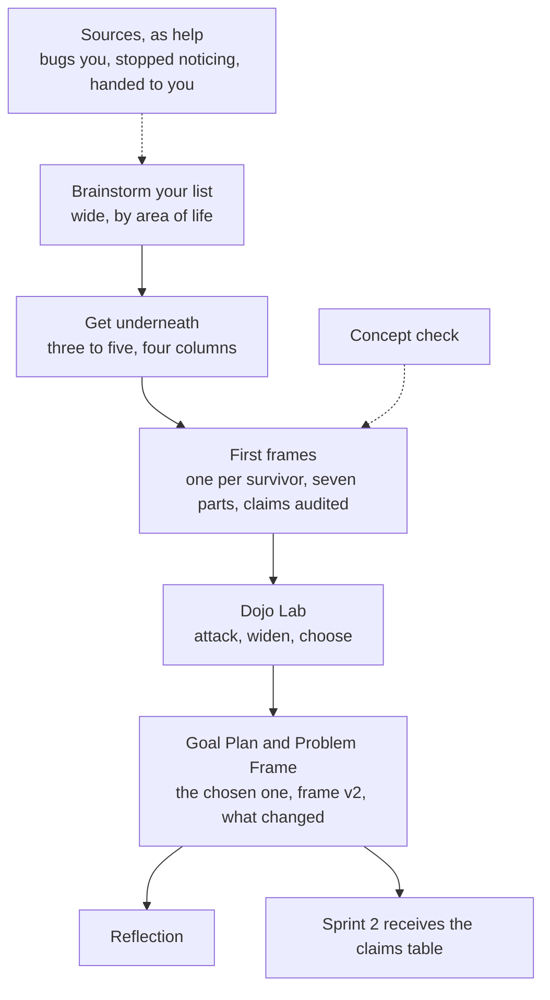

# Sprint 1, resequenced: outline

## What changed and why

On 14 September Leslie ran the live first half and the half-two frame page on herself,
start to finish. The sequence she actually followed differs from the one that is built,
and the difference has one cause: every step that asked her to write down something she
had not yet written worked, and every step that asked a question her own week had already
answered felt useless. Three consequences.

1. **The list comes first and it is wide.** A long brainstorm by area of life, triggered by
   walking the week, before anything is examined. The three sources (what bugs you, what
   you stopped noticing, what somebody handed you) become optional help for a short list,
   not the structure of the activities.
2. **The frame is how you find out which candidate is worth choosing.** Three to five
   candidates get a first frame each. Commitment moves from the end of half one to the end
   of the Dojo Lab. The two dispositions survive; the hinge moves.
3. **Two of the four checks leave Sprint 1.** Real people and current handling worked and
   are now parts 3 and 4 of the frame. Live now was answered on entry by a list built from
   the actual week, and Sprint 3 tests it anyway. Right size did not land as written; the
   Dojo Lab can ask its three questions where they become answerable.

## The sequence

| # | Item | Kind | Points | Week | The learner leaves with |
|---|---|---|---|---|---|
| 1 | Introduction | Page | | One | The arc, rewritten; the narrow no-AI rule, stated once |
| 2 | Brainstorm your list | Own your progress | 0 | One | A long list by category, from a walk through the week |
| 3 | Get underneath three to five | Own your progress | 0 | One | Four columns per item and a gap sentence, second pass done |
| 4 | Concept check | Self-check | 5 | One | Six questions, rewritten against the new pages |
| 5 | The problem frame | Page | | One | The seven parts, two worked examples |
| 6 | First frames | Graded item | 35 | One | A frame for each survivor, claims audited, gaps marked |
| 7 | Dojo Lab | Own your progress | 0 | Two | Frames tested and widened; one chosen, with reasons |
| 8 | Goal Plan and Problem Frame | Graded item | 50 | Two | Frame v2 of the chosen problem, and what changed from v1 |
| 9 | Sprint 1 Reflection | Graded item, ai_activity | 10 | Two | Before-and-after record |

Nine items, 100 points, one graded item per week, concept check as self-check. Week 1
matches Sathya's rhythm. The 35 for First frames is the 35 Test and Commit carried.

## Each item, briefly

**2. Brainstorm your list.** Ten minutes. Categories the learner names for themselves
(work, home, extra activities, personal, other). Triggers: your typical week, your to-do
list, your calendar, your inbox. Everything goes on; nothing is examined yet. Collapsed
help for a short list: the three sources with their moves, from the current activities.
Without AI, for the narrow reason: AI has no access to your week.

**3. Get underneath three to five.** Pick three to five from the list. The criteria are
rough and stated as rough: would make a real difference, not something you could fix this
week, no solution you already know of. Four columns: the item (word open), how it works
now, what it costs and whom, then a gap sentence written from the three. Second pass on
the gap: if it describes a process, rewrite it as who does not know or cannot do what.
Without AI, same reason. Table work in the Candidate Log.

**4. Concept check.** Rewritten by Jeremy against items 2, 3, and 5 once they are stable.

**5. The problem frame.** Leslie's 14 September page, house-styled: seven parts, 3 and 4
split into a and b, part 6 as a part-by-part audit into a claims table with status and
kind (checkable, prediction, causal bet), part 7 as what is left over. Written 2, 3, 4,
then 5, then 6 and 7, then 1 last. Two worked examples: account handovers, and the
garden plot for a qualitative problem that passes the household test. The opening line
changes to say you have three to five candidates, not one.

**6. First frames.** One frame per survivor, from the table cells carried forward and
tagged. Graded on the frame being in the learner's words, costs attached to people, part
5 a state not a solution, the claims table filled with at least one confirmed row where
one exists, and gaps marked rather than filled. Without AI: the next item needs an
independent view to test.

**7. Dojo Lab.** Three moves, in any chatbot while the proxy is down, prompts given in
full. Attack: hand it each frame and ask which claims are asserted rather than known, and
which costs have nobody attached. Widen: three other ways to see the same situation and
what each makes visible. Choose: with all frames tested, which one, and why you. The
standard for the output: every frame is still in your words. Records the specific-and-costly
pushback the spine asks for. Right size's three questions live here if kept.

**8. Goal Plan and Problem Frame.** The chosen problem. Frame v2, then a short account of
what changed from v1 and why, then the claims table as the hand-off to Sprint 2, which
replaces the single riskiest assumption as the seed for the confirmation plan.

**9. Reflection.** Unchanged in mechanism: ai_activity with follow-ups and JSON upload,
matching Sprints 3 and 4. Content: the before-and-after of the chosen frame.

## What this touches outside the sprint pages

- **The Candidate Log template.** Parts A to D follow the old sequence. Rebuilt to: A, the
  brainstorm by category; B, the four-column table; C, the frame, repeated for each
  survivor, with the claims table; D, the Goal Plan's frame v2 and what changed.
- **The Sprint 2 outline.** Must receive the claims table rather than the riskiest
  assumption, and its think-first artifact can be the learner's own read of what already
  handles the problem, which part 4a now starts.
- **The spine.** Section 3's four checks stay course-level; section 9 changes where Checks
  3 and 4 are introduced. Section 7's table row for Sprint 1 changes.
- **Melisa's run.** She is on the published first half. Decide whether she finishes it or
  waits for the resequenced version.
- **The handoff.** Week 2 table and the what-to-do-next list.

## The build path

One working draft for the whole sprint, `sprint-1-working-draft-v5.md`, nine items in
order, each activity carrying its response tasks and criteria so the cut is mechanical.
Jeremy cuts items 1 to 4 through his intake, which regenerates the six locked files and
their sidecars. Items 5 to 9 are new and can be written directly as artifacts by Claude
or cut by Jeremy, whichever he prefers. Everything `publish: false` until Leslie merges.

The 11 September cut took about a day. Drafting v5 is the longer part, and most of its
text exists: the frame page is written, the current activities supply the sources and the
worked cases, and the half-two draft v1.1 supplies the Dojo Lab, Goal Plan, and Reflection
skeletons.

## Decisions for the 15 September meeting

Team decisions, because they touch the pipeline, points, or Melisa's time.

1. The resequence itself, and commitment moving to the Dojo Lab.
2. Points as tabled: 35 for First frames, 50 for the Goal Plan, 10 for the Reflection.
3. Whether Melisa finishes the old first half or waits.
4. Who cuts items 5 to 9.

## Leslie's calls

Content decisions inside pages Leslie owns. Claude's recommendation after each.

5. Whether Check 4 is dropped or lives in the Dojo Lab. Recommendation: the Dojo Lab. Its
   three questions are unanswerable before a frame exists and nearly automatic after one,
   since parts 4a, 3a, and 6 of the frame are those three answers.
6. The word for the first column of the table. Recommendation: "the situation." Not yet a
   problem, more than an item, and wide enough for the wishes and hand-me-downs that
   appeared on the fixture list. The frame page already uses the word.
7. Whether the select step states its criteria or leaves them to instinct. Recommendation:
   state them, as rough. They worked unnamed for someone who had the four checks in her
   head; a participant does not.

## Provenance

Human (Leslie): the run, every finding in it, the item list, the frame page, the
resequence. AI (Claude): the reading of the pattern behind the findings, the table, the
diagram, the build path, the list of what it touches. The frame page's structure
(the a and b splits, the claims table, the kinds, the second goal test, the writing order)
came from an exchange Leslie ran in another chat; the audit and all wording are hers.
