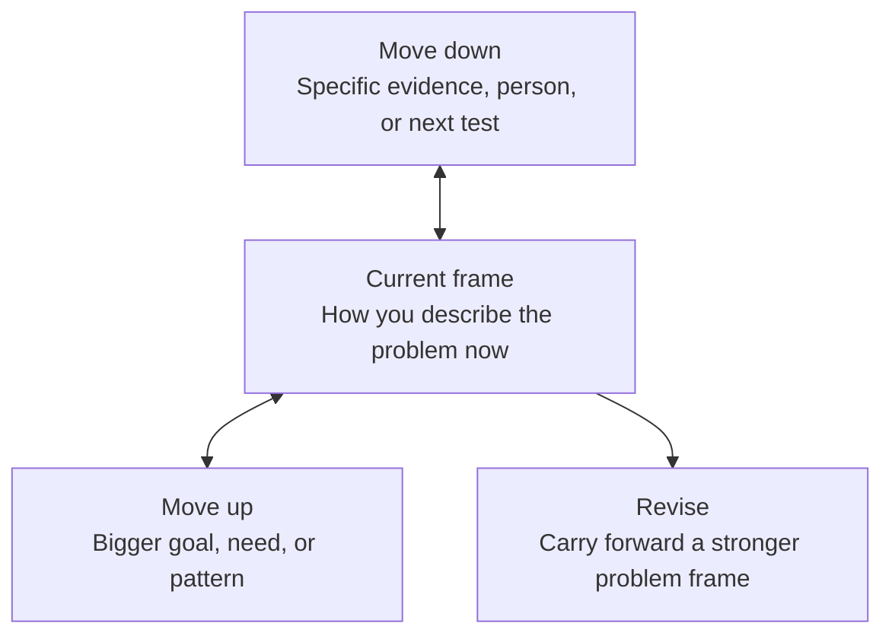

# Concept: From Goal To Problem

## What Problem Framing Is

Problem framing is the work of deciding what problem is actually worth solving before you try to solve it. A goal points you in a direction, but a goal is not yet something you can act on. Framing turns that direction into a specific, testable problem so the effort you spend, with or without AI, goes toward the right thing.

## Start With Three Terms

- Goal: what you want to achieve.
- Problem: the specific obstacle between you and the goal.
- Frame: the particular way you have defined that problem. A different frame points to different solutions, so your first frame is provisional and you should expect to revise it as you learn more.

The course begins by separating goals, problems, and frames because AI can quickly generate solutions for the problem you give it. Your job is to make sure the problem you give it is worth working on.

## Surface Requests Hide Underlying Problems

A surface request often starts as something like make a dashboard, write a policy, automate the emails, or use AI for scheduling. The underlying problem may involve unclear handoffs, missing information, conflicting incentives, mistrust, or a process no one owns.

A workplace example:

- <strong>Workplace goal:</strong> "Reduce delays in onboarding."
- <strong>Surface request:</strong> "Make a dashboard so everyone can see where each new hire is."
- <strong>Stronger problem frame:</strong> "Managers, HR, and IT do not share one handoff process, so equipment and account setup happen late. The next thing to test is where the delay actually starts."

A job-search example works the same way:

- <strong>Career goal:</strong> "Get a better job."
- <strong>Surface request:</strong> "Use AI to rewrite my resume."
- <strong>Stronger problem frame:</strong> "My resume lists responsibilities, but it does not show evidence that I can solve the kinds of problems in the roles I want. The next thing to test is which role requirements I can prove with real examples."

## Use The Abstraction Ladder

An Abstraction Ladder is a way to move between the specific situation in front of you and the larger purpose behind it. Moving up helps you ask what the problem is really about. Moving down helps you turn that broader understanding back into a specific problem you can test. This is the move that connects a broad goal to a workable problem.

Use the visual first, then use the table below it as the text version.

| Ladder move | Question to ask | Example |
| --- | --- | --- |
| Move up | What bigger goal, need, or pattern is behind this? | This is not just a dashboard issue. It may be an ownership and handoff issue. |
| Current frame | How am I describing the problem right now? | New hires are delayed because setup tasks fall through the cracks. |
| Move down | What specific condition, evidence, person, or next test would make this clearer? | Ask HR and IT where the last three delays started, then compare their handoff steps. |

The ladder matters when using AI because AI can respond fluently to a weak frame. The ladder helps you slow down, use your own context, and improve the frame before you start asking for solutions.

> ▢ FILLER: final abstraction-ladder asset and definition to be developed (low priority; scope lightly). Add a clearer ladder visual and a short worked example alongside the two above, and keep the line that connects the ladder move to the goal-to-problem shift.

## A Strong First Frame

You do not need to be certain in Sprint 1. You need a frame that is honest enough to test. A strong first frame names what you know, what you assume, who is affected, and what evidence you need next.

## Practice With The Problem You Chose

Use the real goal you are carrying into this course. It may come from work, a job search, a career transition, community work, caregiving, learning, or a portfolio you want to build. The important thing is that actual people, constraints, and evidence are involved.

- Write the goal in one sentence.
- Write the first problem statement in one sentence.
- Name one concrete example that shows the problem.
- Name one assumption that could be wrong.
- Name one real person or role affected by the problem.
- Move one step up the Abstraction Ladder and write what the problem may really be about.
- Move one step down the ladder and name the next piece of evidence you need.
- Revise the problem statement if the ladder changed your thinking.

## Self-Check

Ask yourself these questions about the frame you chose:

- What decision does solving this help me make?
- Am I describing a symptom or a cause?
- Would someone else describe this the same way?

## Check Your Understanding

Before you move to the next activity, choose the version of the problem frame you want to carry forward. Write one sentence in your notes that names the concrete next choice this problem is blocking. If the sentence could apply to anyone, add more of your own context.

## Before You Move On

- Read: this page and `Start Here: Frame What Is Worth Solving`. New to the course? Start with **Welcome: Start Here** and the **Tutorials and Resources** hub in the Welcome and Orientation module.
- Do: choose a real goal and write before using AI.
- Submit: nothing from this page. Later activities name what to upload.
- Save: goal, surface request, ladder notes, AI pushback, feedback, and revised problem statement.
