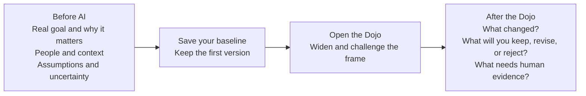

# Pre-Dojo Goal Pause

## Dojo Overview (Placeholder)

> ▢ FILLER: final overview copy to be developed. Add a short Dojo overview and intro with clear instructions on what your problem should include at this stage. This step is thinking only: no AI yet. Name your goal, the people affected, your first problem statement, and what you already assume.

## Purpose

Before working with AI in the Dojo, write down your own thinking first. This captures your starting point so you can see how your problem changes once AI pushes on it. This pause protects your own context, judgment, and motivation before the Dojo expands or challenges your thinking.

## Choosing a Good Goal

A good goal is a real problem from your own work OR a personal or professional goal you genuinely care about. It should be big enough to explore for 10 weeks but specific enough to act on. It does not have to be work-related; it does have to matter to you, because you will carry it through all five sprints.

## Before AI And After The Dojo

This assignment creates your "Before AI" baseline. The Dojo and later Sprint 1 activities will help you compare what changed without replacing your judgment.

Complete the "Before AI" side now. Save this first version so you can later identify what changed, what you chose to keep, and what still needs evidence from a real person.

## Task Instructions

1. Choose one real current goal you may want to work on for the course.
2. Write for 10 to 15 minutes without asking AI for help.
3. Include a problem context that affects actual people. If you are not currently employed, use a real context such as planning a career change, organizing a community event, or improving a personal habit.
4. Mark any sentence that feels uncertain instead of trying to make it sound finished.

## Deliverable

Submit a text entry with:

- The career, work, life, community, or portfolio goal you think you want to pursue.
- Why it matters now.
- Who is affected if nothing changes.
- What you already assume about the problem.
- One sentence you are not yet confident about.

## Submission Format

Text entry in Canvas.

## Evidence Of Success

Your submission should be specific enough that another person can understand your context, your reasoning, and what you are ready to do next. Do not submit a polished AI answer without showing your own judgment.

## How the Dojo Works (Placeholder)

> ▢ FILLER: final tutorial to be developed. Add a small tutorial or overview of how the Dojo works and link to **Tutorials and Resources** in the Welcome and Orientation module.

## Portfolio Capture

Save this pause. You will compare it with your post-Dojo and post-peer versions to show how your thinking changed.
