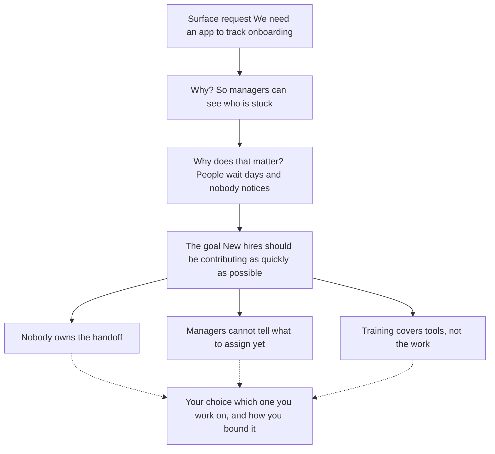

# Things somebody handed you

### Solutions that arrive before the problem

This one is a little tricky, but if you look for it, odds are you'll find some examples in your own experience. The idea here is that sometimes, maybe especially at work, we are handed solutions that don't match the problem they are trying to solve.

"We need an app to track where new hires are in their onboarding process."

This person has expressed that they want an app to track where new hires are in the onboarding process. Maybe they have sufficiently analyzed what's happening to know this is the right solution. However, very often, they haven't. Instead, maybe they decided to build an app because they like new apps, or because their colleague at another organization just built one, or maybe they do know that the onboarding process isn't smooth and they assume an app will make it better. In this situation, someone is naming what should be built rather than what should be different. They are assuming an answer before anyone has determined what the question is.

We'll call this type of indicator a surface request. We handle surface requests a little differently than the other indicators. The other two sources start vague and get specific. A surface request is already specific, and settled on the wrong thing. So instead, you go up first, to the goal the request is serving, and only then back down to the problem.

#### The way up is to keep asking why

Ask until you reach something nobody would argue with.

*We need an app to track where new hires are.* **Why?** So managers can see who is stuck. **Why does that matter?** Because people sit for days waiting on something and nobody notices. **Why does that matter?** Because new hires should be contributing to their teams as quickly as possible, and right now they are not.

That last answer is the goal. Two things tell you that you have arrived:

- Nobody in the organization would dispute it.

- It says nothing about what to build.

If your answer still contains a solution, you have not gone far enough. "So we have better visibility" is not a goal. It is the original request wearing a different coat.

#### The goal opens up the problem

Now that you have the actual goal stated plainly, let's take another look at the request. Tracking visibility of where new hires are in the onboarding process is only one of several things that could be going wrong:

- Maybe nobody owns the handoffs from HR to IT to their department, so setup steps fall through and the first week is lost.

- Maybe managers cannot tell what a new hire should be capable of at week two, so they under-assign and wait.

- Maybe training covers the tools but not the actual work, so people finish it and still cannot start.

All three are plausible. All three are real in some organizations. Each one would send you down a different path, and only the first is a visibility problem that an app might touch.

On a narrow screen, scroll the diagram sideways to see all three possible problems. The examples above describe the same paths.

The chain did not hand you a problem. It handed you a goal and three candidates for what is in the way. Which one you work on, and how you bound it, is your call. Nothing in the goal or the request decides it for you, and making that choice deliberately rather than by default is a large part of what this sprint is for.

#### When the move gave nothing back

Sometimes you run the move and get nothing back. Not thin, nothing.

Look at the fourth example from the first activity's list: "I should be better at using AI at work." If an item on your own table gave the move nothing back, it probably belongs here too.

Ask how that works now and there is no answer, because "use AI" is not something that is happening. It is something you have decided to do. That is the tell: **you have written down a solution, not an indicator.** The move you have been using only works on things that are already going on.

The way out is not to push harder. It is to ask what made you want that solution in the first place. Someone who wrote that line might find, underneath it, that information arrives in email, Slack, and meeting notes and gets re-entered by hand into calendars, to-do lists, and reports, because nothing connects those systems. That is a current state, and this move works on it normally.

Solutions you have handed yourself are common enough to deserve their own treatment, which is the next section.

#### The requests you hand yourself

It's important to note that requests do not only come from other people. It is well worth looking at the requests we give ourselves.

"I need to fix my resume."

Nobody assigned that. It still hands you a solution before anyone has named the problem, and the same chain applies:

*I need to fix my resume.* **Why?** Because I am not getting interviews. **Why does that matter?** Because I have been applying for five months and I am running out of runway. **Why does that matter?** Because I need to be in a role that uses what I am good at and pays what the work is worth.

That is the goal. And once it is stated, the resume is only one of the things that might be in the way:

- The roles you are applying to do not want what you are strongest at, so the resume is fine and the targeting is wrong.

- Your resume lists responsibilities rather than evidence of solving the problems these roles have.

- You are applying cold to postings where these roles get filled through referrals.

Only the second is a resume problem. The first is a targeting problem and the third is a channel problem. Fixing the resume would consume weeks and change nothing in two of the three cases.

A self-issued request is harder to notice than one from a manager. When your boss hands you a solution, it is at least visibly someone else's answer. When you hand it to yourself, it feels like something you already figured out. "I should be better at using AI at work" is one of these. So is "I need to get organized," and "we should have a better process for this."

Check your list. Anything phrased as "I need to" or "we should" is usually a request wearing a problem's clothes.

### The test

Whatever is in front of you, ask this:

**Does it name what should be different, or does it name what should be built?**

If it names what should be built, you have a request, and there is a problem underneath it you have not seen yet. If it names something that should be different but you cannot yet say who it costs and what it costs them, you have an indicator and you are not finished going down.

Find the gap, and you have a candidate problem.

### Your turn: go up, then down

Look at your table for two kinds of row: anything somebody asked you for, and anything you wrote in the shape of "I need to" or "we should." Include any row you marked in the first activity because the move gave nothing back.

Take each one up the chain. Why? Why does that matter? Keep going until you reach a goal nobody would dispute and that says nothing about what to build. Write the goal down.

Then fan out. List two or three things that could be standing between the current situation and that goal. You do not have to be sure. You are naming possibilities, and only the ones you can actually see from where you sit go any further.

Put those into the table as their own rows and run the move on each of them like any other indicator: how does it actually work now, and what gap is starting to show. The request itself does not get a row. The problems underneath it do.

If the chain brings you back to the original request as the only thing in the way, that is a result too. It means someone did the analysis, and you can keep the row as it was.

### Where you are now

Your table now holds candidate problems from up to three sources: things that bugged you, things you had stopped noticing, and things that arrived as requests. Some rows are one pass deep and some are three. That is fine.

Count what you have. Three is the floor for the graded work that follows, and five is plenty. If your first list already gave you four rows with a gap showing, the second and third activities were reading, and that is what "encouraged, not required" means. What they are for is making sure the list you carry forward was gathered from more than one place, because the source you skip is usually the one hiding the problem that would have survived.

### What to submit

Your table, with any rows added from requests and the move run on each.

## Submit in Canvas

Copy your response and submit it as a text entry in Canvas. Saving in this activity keeps a browser draft; it does not submit your work. Keep your table in your own document so you can add to it in Test and commit.
