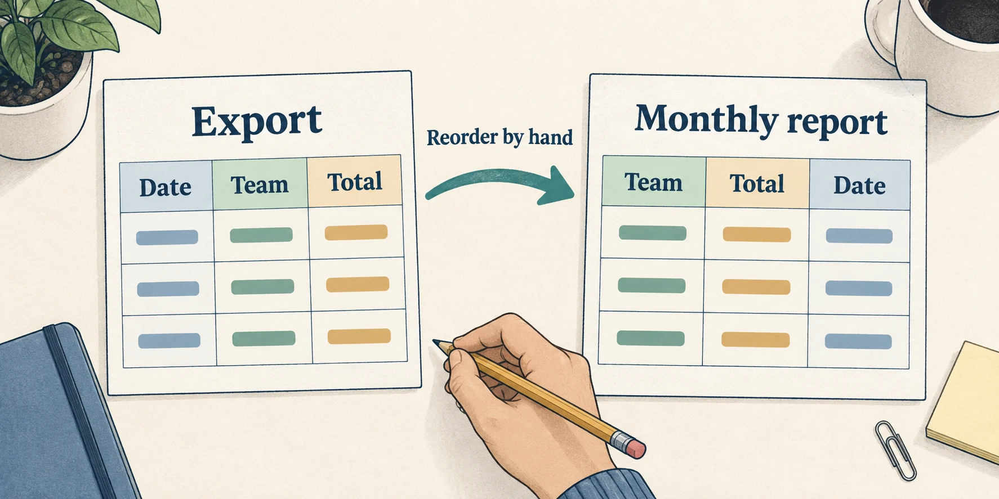

# Things you stopped noticing

## 1. Watch your routine

Over the next **day or two**, notice a step you redo, a person you chase, or a private file you keep because the shared version does not work for you. Keep the table from **Start your list and get underneath it** nearby. Work without AI.

A **workaround** is something you do to get around a difficulty. Repeating it can make its cost feel like an ordinary part of the job.

> **Illustrative worked example · Monthly report**
>
> 
>
> *Illustrative column mismatch. Image created with AI for this course.*
>
> **Notice:** Every month, you fix the exported report columns by hand.
>
> **Current work:** Each analyst rearranges the same columns in a separate copy.
>
> **Possible gap:** The repeated fixes may cost the team time that one shared correction could save. (?)

## 2. Add what you notice

Add observations as they happen. Keep your earlier rows and use the same three columns:

- **What bugs you:** the routine you noticed.
- **How it actually works now:** the workaround and who performs it.
- **The gap starting to show:** the cost or shortfall it reveals. Mark uncertainty with **(?)**.

Two new rows is a useful result, not a minimum. If you watched and found nothing new, say so. Keep your cumulative table for **Things somebody handed you**.
