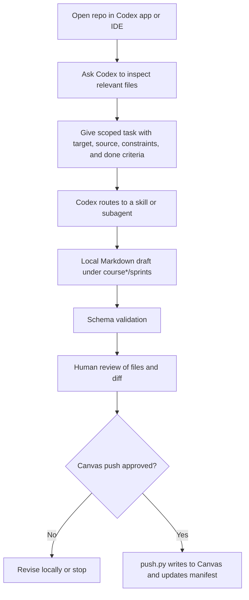
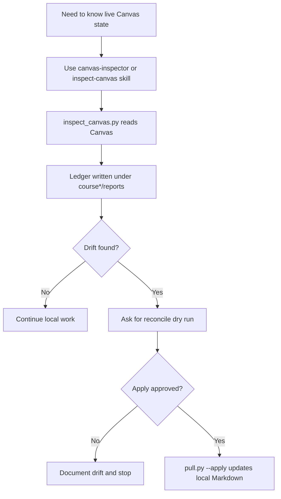
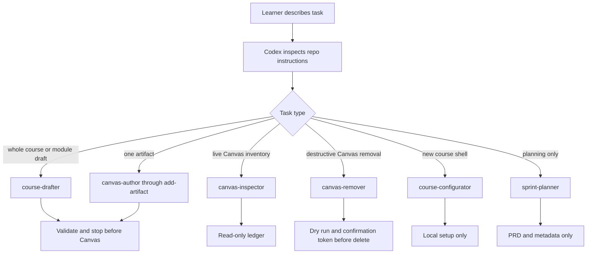

# Workflow Diagrams

## Local Draft To Canvas

```mermaid
flowchart TD
  A["Open repo in Codex app or IDE"] --> B["Ask Codex to inspect relevant files"]
  B --> C["Give scoped task with target, source, constraints, and done criteria"]
  C --> D["Codex routes to a skill or subagent"]
  D --> E["Local Markdown draft under course*/sprints"]
  E --> F["Schema validation"]
  F --> G["Human review of files and diff"]
  G --> H{"Canvas push approved?"}
  H -->|No| I["Revise locally or stop"]
  H -->|Yes| J["push.py writes to Canvas and updates manifest"]
```

## Canvas Inspection Before Reconcile

```mermaid
flowchart TD
  A["Need to know live Canvas state"] --> B["Use canvas-inspector or inspect-canvas skill"]
  B --> C["inspect_canvas.py reads Canvas"]
  C --> D["Ledger written under course*/reports"]
  D --> E{"Drift found?"}
  E -->|No| F["Continue local work"]
  E -->|Yes| G["Ask for reconcile dry run"]
  G --> H{"Apply approved?"}
  H -->|No| I["Document drift and stop"]
  H -->|Yes| J["pull.py --apply updates local Markdown"]
```

## Subagent Routing

```mermaid
flowchart TD
  A["Learner describes task"] --> B["Codex inspects repo instructions"]
  B --> C{"Task type"}
  C -->|"whole course or module draft"| D["course-drafter"]
  C -->|"one artifact"| E["canvas-author through add-artifact"]
  C -->|"live Canvas inventory"| F["canvas-inspector"]
  C -->|"destructive Canvas removal"| G["canvas-remover"]
  C -->|"new course shell"| H["course-configurator"]
  C -->|"planning only"| I["sprint-planner"]
  D --> J["Validate and stop before Canvas"]
  E --> J
  F --> K["Read-only ledger"]
  G --> L["Dry run and confirmation token before delete"]
  H --> M["Local setup only"]
  I --> N["PRD and metadata only"]
```
