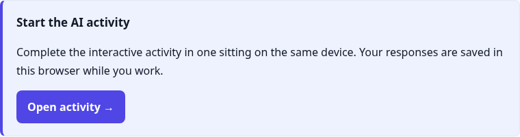
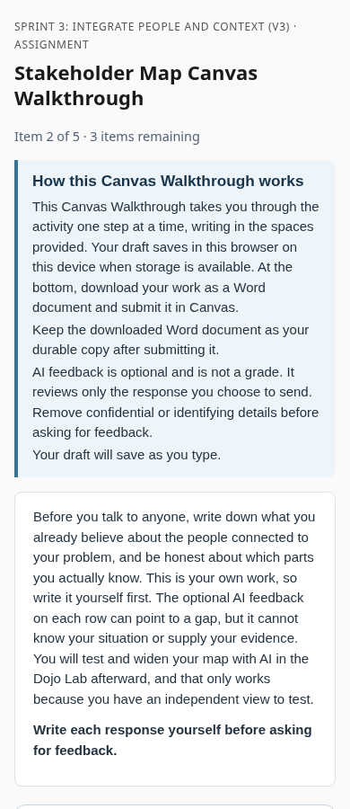
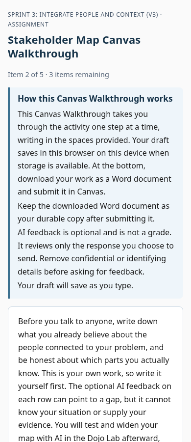

# Course 180 shared-style consistency review

Prepared against Applying AI at Work main `8d9c589aabb7a5b0243d3f604494c29ac732f71a`,
Common Curriculum `74569ebcbb75a471bdb8725f364192d29f7eb00b`, and deployment state
`8db17e38ffa0d380d36d5747568e10baa5e354c3` on October 1, 2026.
PR 206 contributes a grading-rubric draft only. Its content and pending grading
choices are unrelated to this CSS repair and remain unchanged.

## Findings and bounded changes

The established baseline is the approved Sprint 1 reading presentation documented
in `docs/AUTHORING_PRESENTATION.md`: system sans-serif, 16px body text, restrained
navy/slate accents, light surfaces, and a visible amber keyboard-focus outline.
The inconsistencies come from separately embedded layout CSS and an AI engine
that defaults to another course's indigo theme. This repair shares a visual
foundation; it does not replace the existing page structures.

| Surface and source | Observed inconsistency | Decision |
| --- | --- | --- |
| AI Feedback: What Changed and Try It, `course1/sprints/sprint-13/ai-feedback-check.md`; `_render_ai_activity_wrapper_document` in `canvas_sync/hosted_html.py` | Violet `#4f46e5` actions, 24px title, blue-gray page background instead of the ordinary page palette | Use shared navy primary action, 22px item title, background and borders |
| AI engine shell, `_render_ai_activity_shell_document`; Common `css/activity-styles.css` | Another course's indigo theme, Arial browser-default buttons, inconsistent focus outline | Locally theme the existing engine through CSS variables; inherit the system control font and amber focus. Shared engine files and behavior remain untouched |
| Stakeholder Map and other walkthroughs, `canvas_sync/assets/guided-walkthrough.css` | 15px/1.5 body copy versus 16px/1.65 reading copy; different blue buttons and focus hue | Share body typography, primary-action tokens, control borders and focus |
| Orientation, introductions, discussions and guided concept checks; `guided-reading.css`, `guided-assignment.css` | Several near-identical border and control colors maintained separately | Shared card/control tokens and heading color, preserving reading flow and secondary actions |
| Reflections and standard pages; ordinary hosted document renderer | General section cards and headings differ from reading pages | Keep section structure; align shared surface, border, title and link treatments |
| Set up your AI Dojo; reading renderer and copy-source controls | Same learning surface as introductions, with independent copy-button styling | Reuse primary controls and focus; preserve all videos, captions, downloads and instruction-copy text |
| Scheduled homepage; `scheduled-homepage.css` | Arial, separate blue, 1.55 line spacing and blue focus | Reuse system font, navy and focus tokens; preserve schedule, disclosure controls, links and progress behavior |
| First Frames walkthrough at 320px | Existing prose table causes whole-page horizontal overflow | Shared text wrapping removes page overflow; editable wide tables still scroll internally |

Intentional differences retained: 68ch/76ch reading columns, 1100px table
workspaces, larger navigation-page headings, instructional section spacing,
compact versus continuous reading layouts, accordion controls, dense table cells,
secondary utility buttons, green completion/feedback, error/warning states,
and AI mobile guidance. These serve different tasks, rather than representing
a separate course brand.

## Evidence and exact generated scope

[Current item inventory](course180-style-review/current-items.csv) lists the
40 published item pages reviewed, including both still-published Brainstorm
versions. This is a page inventory, not a claim of 40 distinct learning activities.
[Generated scope](course180-style-review/generated-scope.json) identifies exactly
44 HTML candidates: those 40 pages, the separate AI runtime shell, and the three
homepage/directory files (`home.html`, `index.html`, `modules.html`).

Candidates live only under `/tmp/course180-style/delivered-after/`. Each was made
from the current Common Curriculum HTML by adding one shared style block. Removing
that block reproduces the original bytes exactly. Source-rendered before/after
previews separately confirm the renderer applies the same theme. No Common
Curriculum checkout, JSON configuration, progress map, script, media asset,
instructional Markdown, rubric, publication flag, identity, or link was changed.
The rendering integration also themes future course1 module indexes; no module
index regeneration is included in this 44-file review scope. Other courses retain
their existing output.

AI launch action before and after:

Walkthrough mobile reading before and after:

## Validation

- 353 unit tests passed, one skipped. New tests verify ordinary, AI and index
  output coverage, unchanged non-style bytes and JSON, course2 isolation,
  idempotence, and inclusion of the theme in delivery hashes.
- Full source schema and link audit passed: 190 artifacts, 53 links, zero errors.
- Chromium inspected 43 distinct delivered views at 1280, 390 and 320px before
  and after: 258 page/viewport combinations. The index alias duplicates home.
  No JavaScript errors; no post-change page overflow. The only baseline overflow
  was First Frames at 320px. See [sweep results](course180-style-review/delivered-visual-summary.json).
- Six representative source-rendered pages pass the existing browser checker:
  Dojo Lab, introduction, reflection, concept check, discussion and Dojo setup.
  Checks include draft persistence, copy/fallback, radio-key behavior, visible
  focus, disclosure controls, desktop/mobile layout and enlarged base text.
- Separate walkthrough/interleaved/homepage checks verify 76 walkthrough draft
  fields survive reload, keyboard accordion operation, Word download, internal
  table scrolling at 390/320px, Brainstorm keyboard copy and saved responses,
  and homepage keyboard disclosure. See [interaction results](course180-style-review/interaction-results.json).
- The existing walkthrough checker assumes exactly one shared self-check. The
  current Stakeholder Map has two. That assertion fails on the unchanged baseline
  too; its instructional content was preserved, and targeted interaction checks
  cover the page without weakening the repository checker.
- Screenshots were inspected. Browser QA blocks external requests: remote partner
  logos/media may appear blank, and live video playback, AI generation, Canvas
  submission, progress services and screen-reader behavior are not certified.
  Media URLs, captions, alternative text and all script/config bytes are unchanged.

## Release boundary

Draft source PR only. No merge, deployment, Canvas write or state update occurred.
A normal merge can trigger broad publication. Review a controlled, separately
approved hosted-style release before merging or deploying these changes.

Do not blindly regenerate the course: current generated pages can retain older
runtime/sequence versions, the homepage still contains legacy references, and
PR 202's source-only link cleanup remains unpublished. The reviewed 44-file
style-only candidates deliberately preserve all those non-style bytes. A future
release must refresh those exact baselines and reconcile delivery hashes through
the reviewed release process; it must not bundle unrelated content or behavior.
